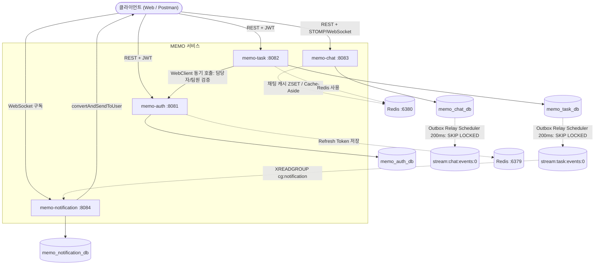
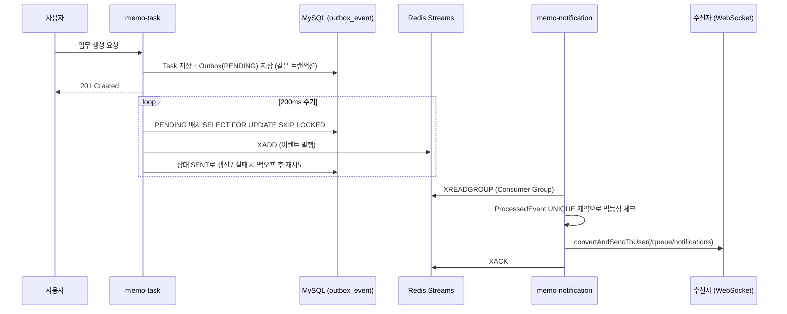

# MEMO

실시간 채팅 · 업무관리 · 인증을 지원하는 **MSA 기반 사내 협업 메신저**

2025 Summer Project

---

## 목차

- [프로젝트 개요](#프로젝트-개요)
- [시스템 아키텍처](#시스템-아키텍처)
- [주요 기능 및 기술적 구현](#주요-기능-및-기술적-구현)
  - [1. JWT 기반 인증/인가](#1-jwt-기반-인증인가)
  - [2. 업무(Task) 관리 및 동적 검색](#2-업무task-관리-및-동적-검색)
  - [3. 실시간 채팅 (STOMP WebSocket + Redis 캐시)](#3-실시간-채팅-stomp-websocket--redis-캐시)
  - [4. 트랜잭셔널 아웃박스 기반 이벤트 발행](#4-트랜잭셔널-아웃박스-기반-이벤트-발행)
  - [5. Redis Streams 기반 실시간 알림](#5-redis-streams-기반-실시간-알림)
- [기술 스택](#기술-스택)
- [모듈 구성](#모듈-구성)
- [API 명세](#api-명세)
- [실행 방법](#실행-방법)
- [설계 노트 / 트러블슈팅](#설계-노트--트러블슈팅)

---

## 프로젝트 개요

| 특징 | 설명 |
|---|---|
| MSA | 인증 · 업무관리 · 채팅 · 알림을 **4개의 독립 Spring Boot 서비스**로 분리, 서비스별 DB를 소유 |
| 실시간 협업 | STOMP/WebSocket 기반 실시간 채팅, Redis Streams 기반 이벤트 전파로 업무 알림을 실시간 push |
| 데이터 정합성 | DB 저장과 이벤트 발행의 원자성을 **트랜잭셔널 아웃박스 패턴**으로 보장, 멱등성 처리로 중복 알림 방지 |
| 무상태 인증 | JWT Access/Refresh Token + Redis 기반 무상태(Stateless) 인증을 서비스 간 공통 모듈로 공유 |

이 프로젝트는 사내에서 사용할 법한 메신저/협업 툴을 가정하고, 단일 애플리케이션이 아닌 **여러 서비스가 이벤트로 느슨하게 연결되는 구조**를 직접 설계·구현해보는 것을 목표로 진행했습니다.

---

## 시스템 아키텍처



> `memo-notification`은 현재 `stream:task:events:0`(업무 이벤트)만 구독합니다. `memo-chat`도 동일한 아웃박스 패턴으로 `stream:chat:events:0`에 이벤트를 발행하지만, 채팅 이벤트를 구독하는 컨슈머는 아직 없습니다 — 다음 확장 포인트로 남겨둔 부분입니다.

`memo-common-security` 모듈은 별도 서비스가 아니라, `memo-auth` / `memo-task` / `memo-chat`이 함께 참조하는 **JWT 검증 공통 라이브러리**입니다 (JAR 의존성으로 포함, 위 다이어그램에는 표시하지 않음).

---

## 주요 기능 및 기술적 구현

### 1. JWT 기반 인증/인가

- Access Token(1시간) / Refresh Token(7일)을 분리 발급하고, Refresh Token은 Redis에 `jwt:refresh:{userId}` 키로 저장해 무상태(Stateless) 인증을 구현했습니다.
- Access Token 클레임에 `userId`, `userName`, `role`을 포함시켜, 다른 서비스가 사용자 이름 조회를 위해 매 요청마다 auth 서비스를 호출하지 않아도 되도록 설계했습니다.
- 로그아웃 시 `CustomLogoutHandler`가 SecurityContext → (없으면) 쿠키의 만료된 토큰 클레임 순으로 `userId`를 복구해 Redis의 Refresh Token을 정리하고, 클라이언트 쿠키를 즉시 만료시킵니다.
- 공통 로직(`JwtTokenProvider`, `JwtAuthenticationFilter`, `CustomUserPrincipal`)은 `memo-common-security` 모듈로 분리해 3개 서비스가 동일한 코드를 재사용합니다.

### 2. 업무(Task) 관리 및 동적 검색

- 업무 생성은 `multipart/form-data`로 JSON 파트와 첨부파일을 함께 받아 처리하며, 첨부파일은 원본 파일명 대신 UUID로 저장해 경로 충돌과 원본 파일명 유출을 방지합니다.
- `Specification`(`TaskSpecification`)으로 "내 업무만", "상태", "제목", "우선순위", "담당자/팀원 이름" 조건을 자유롭게 조합해 검색할 수 있도록 구현했습니다.
- 담당자/팀원을 변경할 때는 `WebClient`로 `memo-auth`에 사용자 존재 여부를 동기 검증해 존재하지 않는 사용자가 업무에 배정되는 것을 방지합니다.
- 댓글, 첨부파일 다운로드 기능을 포함하며, 업무 삭제/수정은 담당자 본인만 가능하도록 서비스 레이어에서 권한을 검증합니다.

### 3. 실시간 채팅 (STOMP WebSocket + Redis 캐시)

- STOMP + SockJS로 pub/sub 구조를 구현: 클라이언트는 `/pub/chat/rooms/{roomId}/messages`로 발행, `/topic/chat/rooms/{roomId}`를 구독합니다.
- WebSocket 핸드셰이크 시 HTTP 인증 결과(`Principal`)를 그대로 세션에 전파하고, `StompHandler`(ChannelInterceptor)가 CONNECT 프레임에서 인증 여부를 재검증합니다.
- 채팅 이력 조회는 **Cache-Aside 패턴**으로 구현했습니다. Redis ZSET(`chat:room:{id}:messages`, score = 전송시각)으로 순서를 유지하고 메시지 본문은 String으로 개별 캐싱하며, 캐시가 일부만 남아있는 경우(TTL 일부 만료 등) 캐시를 신뢰하지 않고 DB에서 재조회 후 캐시를 다시 구축합니다.
- 메시지 수정/삭제는 Soft Delete로 처리하고, 삭제 시 Redis 캐시의 원문을 "삭제된 메시지입니다" placeholder로 덮어써 원문이 캐시에 남지 않도록 합니다.
- JPA 지연 로딩 프록시를 컨트롤러까지 들고 가다 발생한 `LazyInitializationException`을 서비스 계층에서 DTO로 조기 변환하는 방식으로 해결했습니다 (`EAGER` 전환 대신 N+1 문제를 피하기 위한 선택, [설계 노트](README/LazyInitializationException%20error.md) 참고).

### 4. 트랜잭셔널 아웃박스 기반 이벤트 발행

DB 커밋과 이벤트 발행이 분리되면, DB 커밋은 성공했는데 이벤트 발행에 실패해 알림이 유실되는 문제(Dual-write)가 생길 수 있습니다. 이를 막기 위해 `memo-task`, `memo-chat` 모두 동일한 아웃박스 패턴을 구현했습니다.



- 업무/메시지 저장과 같은 트랜잭션 안에서 `outbox_event` 테이블에 이벤트를 함께 저장해 원자성을 보장합니다.
- 별도 스케줄러(`OutboxRelayScheduler`, 200ms 주기)가 `PENDING` 이벤트를 `SELECT ... FOR UPDATE SKIP LOCKED`로 배치 클레임하고, 네트워크 I/O(Redis `XADD`)는 트랜잭션 밖에서 수행합니다.
- 발행 실패 시 지수 백오프(`base × 2^attempt`) + 지터를 적용해 재시도하고, 최대 시도 횟수를 넘으면 `DEAD`로 표시합니다.
- 서버 다운 등으로 `PROCESSING`에 멈춘 이벤트는 `locked_at` 타임아웃 기준으로 주기적으로 복구(`PENDING` 재전환)합니다.

### 5. Redis Streams 기반 실시간 알림

- `memo-notification`은 `XGROUP CREATE`로 Consumer Group을 구성(이미 존재하면 `BUSYGROUP` 예외를 무시)하고, `XREADGROUP`으로 다운타임 동안 쌓인 미확인 이벤트까지 이어서 소비합니다.
- 이벤트 처리 전 `ProcessedEvent` 테이블에 `event_id` UNIQUE 제약으로 먼저 INSERT를 시도해, 이미 처리된 이벤트면 예외를 잡아 바로 ACK 처리하는 방식으로 멱등성을 보장합니다.
- 알림 전송은 성공/실패와 무관하게 ACK을 보내는 정책을 의도적으로 채택했습니다 — 알림 재전송 실패로 무한 재시도 루프에 빠지는 것을 방지하기 위함이며, 원본 데이터(Task/Chat)는 이미 DB에 저장되어 있으므로 알림만 누락되어도 데이터 유실로 이어지지 않습니다.
- 최종 알림은 `SimpMessagingTemplate.convertAndSendToUser`로 `/user/queue/notifications`를 구독 중인 사용자에게 개별 전송됩니다.

---

## 기술 스택

| 분류 | 기술 |
|---|---|
| Language / Runtime | Java 17, Gradle 8.14 (Multi-Module) |
| Framework | Spring Boot 3.5.3, Spring Security, Spring Data JPA, Spring WebSocket(STOMP/SockJS), Spring WebFlux(WebClient) |
| Database | MySQL 8 (서비스별 스키마 분리) |
| Cache / Messaging | Redis (Lettuce) — JWT 세션 저장, 채팅 Cache-Aside(ZSET), Redis Streams(Consumer Group) 기반 서비스 간 이벤트 브로커 |
| Auth | JWT (jjwt 0.11.5), BCrypt |
| Test | JUnit5, Mockito, AssertJ, H2, Spring Security Test |
| Build | Spring Boot Gradle Plugin, Spring Dependency Management Plugin |

---

## 모듈 구성

```
memo/
├── memo-common-security/     # JWT 발급·검증 공통 라이브러리 (JAR)
│   └── common/jwt/            # JwtTokenProvider, JwtAuthenticationFilter, CustomUserPrincipal
│
├── memo-auth/                 # 인증 서비스 (:8081)
│   └── auth/                  # AuthController, AuthService, User, JWT Redis 설정, AdminInitializer
│
├── memo-task/                 # 업무관리 서비스 (:8082)
│   ├── comment/                # 댓글 CRUD
│   ├── file/                   # 첨부파일 업로드/다운로드
│   ├── client/                 # AuthClient (WebClient 기반 서비스 간 통신)
│   └── outbox/                 # 트랜잭셔널 아웃박스 (Task 이벤트)
│
├── memo-chat/                  # 채팅 서비스 (:8083)
│   ├── chat/message/            # 채팅 메시지 CRUD + Redis 캐시(Cache-Aside)
│   ├── chat/room/                # 채팅방 생성/초대/이력조회
│   ├── chat/participant/          # 참여자 권한 검증
│   ├── chat/outbox/                # 트랜잭셔널 아웃박스 (Chat 이벤트)
│   └── webSocket/                  # STOMP 설정, JWT 인증 인터셉터
│
├── memo-notification/           # 알림 서비스 (:8084)
│   ├── consumer/                  # Redis Streams Consumer Group 구독
│   └── domain/                    # ProcessedEvent (멱등성 테이블)
│
└── README/                        # 설계 노트 (JWT 인증 흐름, 채팅방 구조, 트러블슈팅)
    └── APIDocument/                # 서비스별 API 문서
```

---

## API 명세

### memo-auth (`:8081`)

| Method | Endpoint | 설명 | 인증 |
|---|---|---|---|
| POST | `/api/auth/register` | 회원가입 | X |
| POST | `/api/auth/login` | 로그인, Access/Refresh Token을 HttpOnly 쿠키로 발급 | X |
| POST | `/api/auth/logout` | 로그아웃 (Redis Refresh Token 삭제 + 쿠키 만료) | O |
| GET | `/api/auth/users/{userId}/exists` | 사용자 존재 여부 조회 (서비스 간 내부 호출용) | X |
| GET | `/api/auth/users/{userId}/name` | 사용자 이름 조회 (서비스 간 내부 호출용) | X |

### memo-task (`:8082`)

| Method | Endpoint | 설명 | 인증 |
|---|---|---|---|
| POST | `/api/tasks/create` | 업무 생성 (multipart: JSON + 첨부파일) | O |
| GET | `/api/tasks/search` | 업무 검색 (내 업무/상태/제목/우선순위/담당자·팀원 이름 조합) | O |
| GET | `/api/tasks/{taskId}` | 업무 상세 조회 | - |
| PUT | `/api/tasks/update/{taskId}` | 업무 수정 (담당자만) | O |
| DELETE | `/api/tasks/delete/{taskId}` | 업무 삭제 (담당자만) | O |
| GET | `/api/tasks/{taskId}/files` | 업무 첨부파일 목록 조회 | - |
| GET | `/api/tasks/{taskId}/comments` | 업무 댓글 목록 조회 | - |
| POST | `/api/comments/create/{taskId}` | 댓글 작성 | O |
| DELETE | `/api/comments/delete/{commentId}` | 댓글 삭제 (작성자만) | O |
| GET | `/api/files/{fileId}/download` | 첨부파일 다운로드 | - |

### memo-chat (`:8083`)

| Method | Endpoint | 설명 | 인증 |
|---|---|---|---|
| POST | `/api/chat/rooms` | 채팅방 생성 (생성자 자동 참여) | O |
| POST | `/api/chat/rooms/{roomId}/invite` | 채팅방에 유저 초대 | O |
| GET | `/api/chat/rooms/{roomId}/messages` | 채팅 이력 조회 (Redis 캐시 우선, Cache-Aside) | O |
| POST | `/api/chat/rooms/{roomId}/messages` | 메시지 전송 (저장 + Outbox 기록 + 브로드캐스트) | O |
| PATCH | `/api/chat/rooms/{roomId}/messages/{messageId}` | 메시지 수정 (작성자만) | O |
| DELETE | `/api/chat/rooms/{roomId}/messages/{messageId}` | 메시지 삭제 (Soft Delete, 작성자만) | O |
| WS | `/ws-chat` (SockJS) · `/ws-native` | STOMP 연결 엔드포인트 | O |
| SUB | `/topic/chat/rooms/{roomId}` | 채팅방 실시간 메시지 구독 | - |

### memo-notification (`:8084`)

| 구분 | 값 | 설명 |
|---|---|---|
| WS Endpoint | `/ws-notification` | 알림 WebSocket 연결 |
| SUB | `/user/queue/notifications` | 사용자별 실시간 알림 구독 |
| Consumer Group | `cg:notification` | `stream:task:events:0` 스트림을 구독 (현재는 업무 이벤트만 처리) |

---

## 실행 방법

### 사전 요구사항

- JDK 17 이상
- MySQL 8.x
- Redis 인스턴스 2개 (JWT/Refresh Token용 `:6379`, 채팅 캐시·이벤트 스트림용 `:6380`)

### 인프라 실행

```bash
# MySQL
docker run -d --name memo-mysql \
  -e MYSQL_ROOT_PASSWORD=<PASSWORD> \
  -p 3306:3306 \
  mysql:8.0

# Redis - JWT Refresh Token 저장용 (memo-auth)
docker run -d --name memo-redis-auth -p 6379:6379 redis:7 --requirepass <PASSWORD>

# Redis - 채팅 캐시 & Streams 저장용 (memo-chat, memo-task, memo-notification 공용)
docker run -d --name memo-redis-chat -p 6380:6379 redis:7 --requirepass <PASSWORD>
```

각 서비스는 `ddl-auto: update`로 테이블은 자동 생성하지만, 스키마(데이터베이스)는 미리 만들어야 합니다.

```sql
CREATE DATABASE memo_auth_db;
CREATE DATABASE memo_task_db;
CREATE DATABASE memo_chat_db;
CREATE DATABASE memo_notification_db;
```

### 서비스 실행

```bash
./gradlew build -x test

./gradlew :memo-auth:bootRun          # :8081
./gradlew :memo-task:bootRun          # :8082
./gradlew :memo-chat:bootRun          # :8083
./gradlew :memo-notification:bootRun  # :8084
```

> `memo-task`는 담당자/팀원 변경 시 `memo-auth`를 동기 호출(WebClient)하므로, `memo-auth`를 먼저 기동하는 것을 권장합니다.

### 환경 변수

각 서비스의 `src/main/resources/application.yml`에 정의된 값은 Spring Boot의 relaxed binding으로 아래처럼 환경변수 오버라이드가 가능합니다.

| 변수 | 설명 |
|---|---|
| `SPRING_DATASOURCE_URL` / `USERNAME` / `PASSWORD` | 서비스별 MySQL 접속 정보 |
| `JWT_SECRET` | HMAC 서명 키 (4개 서비스 동일 값 필요) |
| `SPRING_REDIS_JWT_HOST` / `PORT` / `PASSWORD` | Refresh Token 저장용 Redis (`memo-auth`) |
| `SPRING_REDIS_CHAT_HOST` / `PORT` / `PASSWORD` | 채팅 캐시·스트림용 Redis (`memo-chat`, `memo-task`) |
| `ADMIN_EMAIL` / `ADMIN_PASSWORD` | 최초 기동 시 자동 생성되는 관리자 계정 (`local`/`dev` 프로필 전용) |
| `FILE_UPLOAD_DIR` | 첨부파일 저장 경로 (`memo-task`) |

> 현재 레포지토리의 `application.yml`에는 로컬 개발 편의를 위한 예시 값이 하드코딩되어 있습니다. 공개 저장소로 운영하거나 배포 환경에 올릴 때는 위 값들을 반드시 환경변수/시크릿 매니저로 분리해야 합니다.

---

## 설계 노트 / 트러블슈팅

개발 중 겪은 문제와 해결 과정을 별도로 기록해두었습니다.

- [JWT Authentication.md](README/JWT%20Authentication.md) — `JwtTokenProvider` / `JwtAuthenticationFilter`의 핵심 흐름과, JWT 필터를 폼 로그인 필터보다 먼저 등록한 이유
- [LazyInitializationException error.md](README/LazyInitializationException%20error.md) — 지연 로딩 프록시로 인한 예외 원인 분석과 DTO 변환을 통한 해결, `EAGER` 대신 이 방식을 택한 이유
- [ChatRoomStructure.md](README/ChatRoomStructure.md) — 채팅방 생성 시 JWT로 생성자를 식별하는 흐름과 도메인 구조
- [APIDocument/ChatRoom.md](README/APIDocument/ChatRoom.md) — 채팅 API/WebSocket 상세 명세
